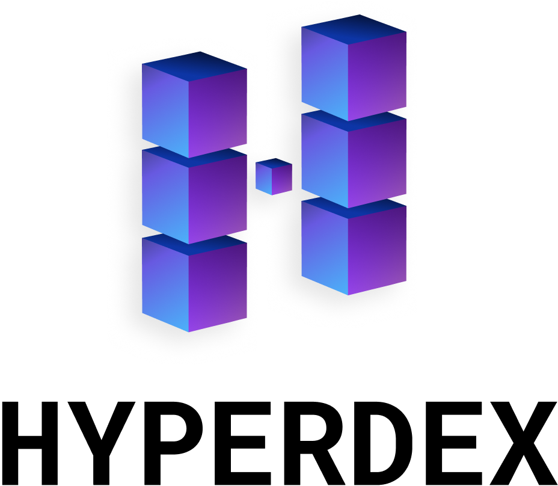

	 
	
	 
	 
	
Grandma-Friendly Atomic Swaps

	 
	
	
	
	
	
	
	 
	 
	

## HyperDEX is a truly decentralised cryptocurrency exchange.

Built on the Komodo Platform's <a href="https://barterdex.supernet.org">BarterDEX</a> network, HyperDEX is entirely peer-to-peer and all trades are made via on-chain atomic swaps. As a result, you are in full custody of your funds the entire time, your private keys never leave your machine.

## Caveats

### This software is currently in beta

There is a risk of loss of funds. Only trade in real currency if you can take that risk. We recommend trading the test currencies `BEER` and `PIZZA` instead. You can get free `BEER` at the `BEER` [faucet](https://www.atomicexplorer.com/#/faucet).

### All communication is currently unencrypted

Currently HyperDEX is vulnerable to MITM attacks and your actions and addresses are broadcast in plain text. Do not use HyperDEX on a public network other than for testing.

Encrypted communication is planned for our first stable release.

### Most electrum servers are currently ran by community members

This means there is an element of trust involved. It's technically possible for a malicious electrum server operator to double spend and therefore reverse swaps.

We are planning to add an option to connect to your own trusted electrum server.

### We currently only require 1 confirmation for each transaction

For many currencies 1 confirmation is cost effective to 51% attack. This would allow an attacker to double spend and effectively reverse trades.

We are planning to add an option to specify the number of confirmations your are comfortable with per currency.

## Install

*macOS 10.9+, Linux, and Windows 7+ are supported (64-bit only).*

### macOS

[**Download**](https://github.com/atomiclabs/hyperdex/releases/latest) the `.dmg` file.

### Linux

[**Download**](https://github.com/atomiclabs/hyperdex/releases/latest) the `.AppImage` (recommended), `.snap`, `.deb`, or `.rpm` file.

*The AppImage needs to be [made executable](http://discourse.appimage.org/t/how-to-make-an-appimage-executable/80) after download.*

### Windows

[**Download**](https://github.com/atomiclabs/hyperdex/releases/latest) the `.exe` file.

## Testing

Please download the latest [nightly build](https://github.com/atomiclabs/hyperdex-nightlies/releases/latest) and report detailed issues with the "Feedback" button in the app.

## Donate

HyperDEX is a free and open source project. You can help support its development by donating to the below addresses:

| Symbol  | Address                             |
| ------- | ----------------------------------- |
| **BTC** | `1HyperDEXfMx459ZFh6Ram5uymS8AiRAQf`|
| **KMD** | `RHyper8TJyHK6uZ3AXzUwC2uVRdt7cfxEC`|

## License

MIT
